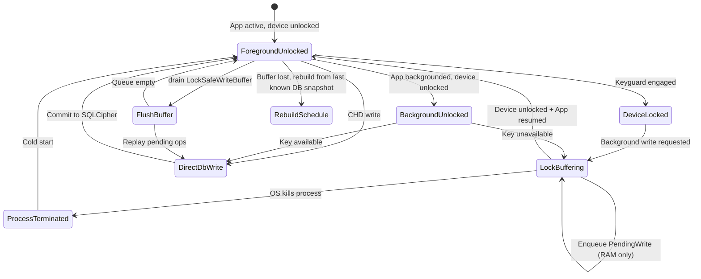

# RxMind Security Storage Architecture

**Document version:** 1.0  
**Last updated:** 2026-07-08  
**Status:** Target specification (implementation tracked in `docs/roadmap.md` Phase 2)  
**Compliance basis:** *Mobile Health App Compliance 2026* — Section 3 (HIPAA, Health Data Privacy, & Secure Architecture)

---

## 1. Purpose & Scope

This document defines the **hardware-backed, local-only encryption architecture** for all Consumer Health Data (CHD) persisted by RxMind. It governs:

- Master key generation and hardware isolation (Android StrongBox / iOS Secure Enclave)
- SQLCipher database encryption and key derivation (PBKDF2 ≥ 100,000 iterations)
- Secure multi-pass cryptographic wipe ("Erase All My Data")
- OS backup exclusion (Android `allowBackup`, iOS iCloud exclusion)
- Lock-state volatile RAM write buffering when the master key is inaccessible

**Out of scope:** Cloud sync, remote key escrow, OCR ephemeral RAM processing (see `docs/architecture/data_isolation.md` when authored), generative AI safety (see `docs/ai_moderation/safety_pipeline.md` when authored).

---

## 2. Current State Assessment

### 2.1 Existing storage layer

| Component | File | Current behavior | Compliance gap |
| --- | --- | --- | --- |
| Plain SQLite | `lib/core/storage/local_storage.dart` | `openDatabase('rxmind.db')` with no passphrase | CHD readable from filesystem |
| Default secure storage | `lib/core/storage/local_storage.dart` | `FlutterSecureStorage()` with platform defaults | No StrongBox / Secure Enclave enforcement |
| Profile wrapper | `lib/core/storage/storage_manager.dart` | JSON string in secure storage; `getUserProfile()` incorrectly casts `String` → `Map` | Runtime bug + no schema |
| App reset | `lib/core/storage/storage_manager.dart` | `deleteAll()` + reopen empty DB | No multi-pass overwrite; CHD in SharedPreferences untouched |
| CHD persistence | `lib/services/discharge_data_manager.dart` | Medications, tasks, OCR text in **SharedPreferences** | Unencrypted at rest |
| Chat history | `lib/core/ai/chat_manager.dart` | Full JSON blob in secure storage key `ai_chats` | Not SQLCipher; may contain clinical content |

### 2.2 Dependencies (`pubspec.yaml`)

| Package | Present | Role today | Target role |
| --- | --- | --- | --- |
| `sqflite` | Yes | Plain SQLite | **Replace** with SQLCipher-backed opener |
| `flutter_secure_storage` | Yes | Key-value secrets | **Restrict** to non-CHD flags only; master key never exported to Dart |
| `shared_preferences` | Yes | Primary CHD store | **Remove** CHD usage; UI-only non-sensitive flags |
| `sqlcipher` / `sqflite_sqlcipher` | **No** | — | **Add** (Phase 2.3) |

### 2.3 Platform backup posture

| Platform | Current | Required |
| --- | --- | --- |
| Android | `AndroidManifest.xml` has no `android:allowBackup` attribute (defaults vary by SDK) | Explicit `android:allowBackup="false"` |
| iOS | No `NSURLIsExcludedFromBackupKey` on database directory | Exclude DB + cache paths from iCloud backup |

---

## 3. Target Architecture Overview

```
┌─────────────────────────────────────────────────────────────────────────────┐
│                           Flutter / Dart Layer                               │
│  DischargeDataManager ──► SecureDatabase ──► SQLCipher (rxmind.db)         │
│  ChatManager ───────────► SecureDatabase                                     │
│  LockSafeWriteBuffer ───► (volatile RAM queue, flush on unlock)             │
└───────────────────────────────┬─────────────────────────────────────────────┘
                                │ Platform Channel: rxmind/crypto
        ┌───────────────────────┴───────────────────────┐
        ▼                                               ▼
┌───────────────────────┐                   ┌───────────────────────┐
│ Android               │                   │ iOS                   │
│ Keystore Master Key   │                   │ Secure Enclave P-256  │
│ StrongBox KeyMint     │                   │ kSecAttrTokenID       │
│ AES-256-GCM           │                   │ SecureEnclave         │
└───────────┬───────────┘                   └───────────┬───────────┘
            │ PBKDF2-SHA256 ≥100k                         │ ECDH + PBKDF2
            ▼                                             ▼
     SQLCipher passphrase                          SQLCipher passphrase
     (never leaves native heap                     (never leaves native heap
      during derivation)                            during derivation)
```

### 3.1 Design principles

1. **Zero cloud:** No CHD bytes exit the device boundary.
2. **Hardware root of trust:** Database keys are derived inside StrongBox / Secure Enclave; raw master key material never enters the Dart VM.
3. **Single encrypted store:** All CHD lives in SQLCipher tables; SharedPreferences limited to theme/onboarding version flags.
4. **Fail closed:** If master key unavailable (device locked, key wiped), database open throws `DatabaseKeyException` — no plaintext fallback.
5. **Verifiable erasure:** User-initiated wipe performs multi-pass overwrite before file deletion.

---

## 4. Hardware Master Key Management

### 4.1 Key hierarchy

| Key / secret | Storage | Algorithm | Lifetime |
| --- | --- | --- | --- |
| **Master Key (MK)** | Android Keystore / iOS Secure Enclave | AES-256 (Android) / P-256 (iOS) | Until app uninstall or explicit wipe |
| **Salt (S)** | Encrypted alongside MK metadata in secure storage | 32 random bytes | Rotates only on full wipe + re-provision |
| **DB Key (DK)** | Ephemeral native memory only during `openDatabase` | PBKDF2-HMAC-SHA256(MK, S, iter≥100000, len=32) | Session; zeroized after SQLCipher open |

**Constant:** `RXMIND_MASTER_KEY_ALIAS = "rxmind_mk_v1"`

---

### 4.2 Android — StrongBox-backed AES master key

**Requirements (Compliance §3):**

- `KeyGenParameterSpec` with 256-bit AES
- `setIsStrongBoxBacked(true)` when `PackageManager.FEATURE_STRONGBOX_KEYSTORE` is available
- `setUserAuthenticationRequired(true)` with `setUserAuthenticationValidityDurationSeconds(-1)` (auth per use) or bounded timeout per product decision
- Purposes: `PURPOSE_ENCRYPT | PURPOSE_DECRYPT`

**Kotlin implementation (platform channel handler):**

```kotlin
// android/app/src/main/kotlin/.../crypto/MasterKeyModule.kt

private const val MASTER_KEY_ALIAS = "rxmind_mk_v1"

fun ensureMasterKeyExists(context: Context): Result<Unit> {
    val keyStore = KeyStore.getInstance("AndroidKeyStore").apply { load(null) }
    if (keyStore.containsAlias(MASTER_KEY_ALIAS)) return Result.success(Unit)

    val strongBoxAvailable = context.packageManager
        .hasSystemFeature(PackageManager.FEATURE_STRONGBOX_KEYSTORE)

    val builder = KeyGenParameterSpec.Builder(
        MASTER_KEY_ALIAS,
        KeyProperties.PURPOSE_ENCRYPT or KeyProperties.PURPOSE_DECRYPT
    )
        .setBlockModes(KeyProperties.BLOCK_MODE_GCM)
        .setEncryptionPaddings(KeyProperties.ENCRYPTION_PADDING_NONE)
        .setKeySize(256)
        .setUserAuthenticationRequired(true)
        .setInvalidatedByBiometricEnrollment(true)

    if (strongBoxAvailable) {
        builder.setIsStrongBoxBacked(true)
    } else {
        // Log security degradation; TEE fallback documented in release notes
        Log.w("RxMindCrypto", "StrongBox unavailable; using TEE-backed Keystore")
    }

    KeyGenerator.getInstance(KeyProperties.KEY_ALGORITHM_AES, "AndroidKeyStore")
        .init(builder.build())
        .generateKey()

    return Result.success(Unit)
}

/** Derive SQLCipher passphrase bytes inside native code; zeroize before return to Dart. */
fun deriveDatabaseKey(context: Context, salt: ByteArray): ByteArray {
    ensureMasterKeyExists(context).getOrThrow()
    val keyStore = KeyStore.getInstance("AndroidKeyStore").apply { load(null) }
    val secretKey = keyStore.getKey(MASTER_KEY_ALIAS, null) as SecretKey

    // Unwrap/export is NOT supported for StrongBox keys — use Keystore cipher
    // to encrypt a random 32-byte DEK at provisioning, OR use Android Keystore
    // to perform HMAC-based derivation via approved API.
    //
    // Pattern: store encrypted DEK blob; decrypt with MK when device unlocked.
    val encryptedDek = loadEncryptedDek(context) // from EncryptedSharedPreferences / secure file
    val dek = decryptWithMasterKey(secretKey, encryptedDek) // 32 bytes

    return pbkdf2Sha256(
        password = dek,
        salt = salt,
        iterations = 100_000,
        keyLengthBytes = 32
    ).also { dek.fill(0) }
}

private fun pbkdf2Sha256(
    password: ByteArray,
    salt: ByteArray,
    iterations: Int,
    keyLengthBytes: Int
): ByteArray {
    val spec = PBEKeySpec(
        password.map { (it.toInt() and 0xFF).toChar() }.toCharArray(),
        salt,
        iterations,
        keyLengthBytes * 8
    )
    return SecretKeyFactory.getInstance("PBKDF2WithHmacSHA256")
        .generateSecret(spec)
        .encoded
}
```

**StrongBox detection at runtime:**

```kotlin
fun isStrongBoxBacked(context: Context): Boolean {
    return context.packageManager
        .hasSystemFeature(PackageManager.FEATURE_STRONGBOX_KEYSTORE)
}
```

**Access policy:** All `deriveDatabaseKey` calls must occur while `KeyguardManager.isDeviceSecure` and the app process is in foreground **or** after `BiometricPrompt` / device-credential success when the key requires user authentication.

---

### 4.3 iOS — Secure Enclave P-256 master key

**Requirements (Compliance §3):**

- Generate NIST P-256 key pair with `kSecAttrTokenID = kSecAttrTokenIDSecureEnclave`
- Accessibility: `kSecAttrAccessibleWhenUnlockedThisDeviceOnly`
- Derive database key via **ECDH** on coprocessor, then PBKDF2

**Swift implementation:**

```swift
// ios/Runner/Crypto/MasterKeyModule.swift

private let masterKeyTag = "org.rxmind.app.mk.v1"

func ensureMasterKeyExists() throws {
    if SecKeyCopyMatching(queryForExistingKey(), nil) != nil { return }

    let flags: SecAccessControlCreateFlags = [.privateKeyUsage, .biometryCurrentSet]
    guard let access = SecAccessControlCreateWithFlags(
        kCFAllocatorDefault,
        kSecAttrAccessibleWhenUnlockedThisDeviceOnly,
        flags,
        nil
    ) else { throw CryptoError.accessControlFailed }

    let attributes: [String: Any] = [
        kSecAttrKeyType as String: kSecAttrKeyTypeECSECPrimeRandom,
        kSecAttrKeySizeInBits as String: 256,
        kSecAttrTokenID as String: kSecAttrTokenIDSecureEnclave,
        kSecPrivateKeyAttrs as String: [
            kSecAttrIsPermanent as String: true,
            kSecAttrApplicationTag as String: masterKeyTag.data(using: .utf8)!,
            kSecAttrAccessControl as String: access
        ]
    ]

    var error: Unmanaged<CFError>?
    guard SecKeyCreateRandomKey(attributes as CFDictionary, &error) != nil else {
        throw error!.takeRetainedValue() as Error
    }
}

func deriveDatabaseKey(salt: Data) throws -> Data {
    try ensureMasterKeyExists()
    let privateKey = try loadSecureEnclavePrivateKey()

    // Ephemeral P-256 key pair for ECDH
    let ephemeralPrivate = P256.KeyAgreement.PrivateKey()
    let sharedSecret = try ephemeralPrivate.sharedSecretFromKeyAgreement(with: privateKey)

    let ikm = sharedSecret.withUnsafeBytes { Data($0) }
    defer { /* zeroize ikm buffer via Data.resetBytes in wrapper */ }

    return try PBKDF2.deriveKey(
        password: ikm,
        salt: salt,
        iterations: 100_000,
        keyLength: 32,
        hash: .sha256
    )
}
```

**Dart facade (`lib/core/storage/master_key_service.dart`):**

```dart
class MasterKeyService {
  static const _channel = MethodChannel('rxmind/crypto');

  /// Returns false if Secure Enclave / StrongBox provisioning failed.
  Future<bool> provisionMasterKey() async =>
      await _channel.invokeMethod<bool>('provisionMasterKey') ?? false;

  /// Opens SQLCipher with hardware-derived passphrase.
  /// Throws [DatabaseKeyException] if device locked or key invalidated.
  Future<Database> openSecureDatabase(String path) async {
    final passphrase = await _channel.invokeMethod<Uint8List>('deriveDatabaseKey');
    if (passphrase == null || passphrase.isEmpty) {
      throw DatabaseKeyException('Master key unavailable');
    }
    try {
      return await sqlcipher.openDatabase(
        path,
        password: passphrase,
        version: 1,
        onCreate: Schema.createAll,
      );
    } finally {
      // Dart-side best-effort zeroization of copied bytes
      for (var i = 0; i < passphrase.length; i++) {
        passphrase[i] = 0;
      }
    }
  }
}
```

---

## 5. SQLCipher Local Encryption

### 5.1 Package selection

Add to `pubspec.yaml` (exact package subject to orchestrator approval):

```yaml
dependencies:
  sqflite_sqlcipher: ^3.1.0  # or sqflite_common_ffi + sqlcipher_flutter_libs
```

Native SQLCipher must be compiled with:

```sql
PRAGMA cipher_page_size = 4096;
PRAGMA kdf_iter = 256000;  -- SQLCipher 4 default; our app-level PBKDF2 is separate
PRAGMA cipher_hmac_algorithm = HMAC_SHA512;
PRAGMA cipher_kdf_algorithm = PBKDF2_HMAC_SHA512;
```

RxMind applies **application-level PBKDF2 (≥100,000 iterations)** before passing the passphrase to SQLCipher, satisfying Compliance §3 even when SQLCipher applies its own internal KDF.

### 5.2 Salt provisioning

On first launch after CHD consent:

1. Native code generates `salt = 32 random bytes` from `SecureRandom` / `SecRandomCopyBytes`.
2. Salt stored in hardware-wrapped blob (Android: encrypt with MK; iOS: Keychain item with Secure Enclave access control).
3. Salt persists until cryptographic wipe.

```dart
// lib/core/storage/key_derivation.dart

class KeyDerivationMetadata {
  final Uint8List salt;       // 32 bytes
  final int iterations;       // >= 100000
  final String schemaVersion; // "v1"
}
```

### 5.3 Database schema (CHD tables)

All tables live in `rxmind.db` only:

```sql
-- lib/core/storage/schema.dart (executed in onCreate)

CREATE TABLE medications (
  id TEXT PRIMARY KEY,
  name TEXT NOT NULL,
  dose TEXT,
  frequency TEXT,
  updated_at INTEGER NOT NULL
);

CREATE TABLE tasks (
  id TEXT PRIMARY KEY,
  title TEXT NOT NULL,
  due_time TEXT,
  completed INTEGER NOT NULL DEFAULT 0,
  payload_json TEXT,
  updated_at INTEGER NOT NULL
);

CREATE TABLE chat_messages (
  id TEXT PRIMARY KEY,
  session_id TEXT NOT NULL,
  role TEXT NOT NULL,
  content TEXT NOT NULL,
  created_at INTEGER NOT NULL
);

CREATE TABLE app_metadata (
  key TEXT PRIMARY KEY,
  value TEXT NOT NULL
);
```

**Migration rule:** Legacy `SharedPreferences` CHD keys are read once, inserted into SQLCipher, then **removed** from prefs (Roadmap task 2.4).

### 5.4 Opening the database (Dart)

```dart
// lib/core/storage/sqlcipher_database.dart

class SecureDatabase {
  static Database? _instance;

  static Future<Database> instance() async {
    if (_instance != null && _instance!.isOpen) return _instance!;
    final dir = await getApplicationSupportDirectory(); // not Documents
    final path = p.join(dir.path, 'rxmind.db');
    _instance = await MasterKeyService().openSecureDatabase(path);
    return _instance!;
  }

  static Future<void> close() async {
    await _instance?.close();
    _instance = null;
  }
}
```

**Acceptance test:** After `adb backup` or filesystem copy of `rxmind.db`, opening the file with stock `sqlite3` CLI prints `file is not a database` or garbage — not readable schema.

---

## 6. Cryptographic Wipe Routine

Triggered from Settings → **Erase All My Data** (requires typing `DELETE` to confirm).

### 6.1 Operational steps

| Step | Action | Owner |
| --- | --- | --- |
| 1 | Cancel all scheduled notifications | `NotificationService` |
| 2 | Close SQLCipher connection | `SecureDatabase.close()` |
| 3 | Multi-pass overwrite database file | Native `SecureWipeModule` |
| 4 | Delete `-wal`, `-shm`, journal sidecars | Native |
| 5 | Delete master key from Keystore / Secure Enclave | Native |
| 6 | Delete salt and wrapped DEK metadata | Native + `flutter_secure_storage.deleteAll()` |
| 7 | Wipe app cache & temp directories | Dart + native |
| 8 | Clear `LockSafeWriteBuffer` | Dart in-memory |
| 9 | Reset in-memory singletons / providers | App layer |
| 10 | Navigate to onboarding / disclaimer gate | UI |

### 6.2 Overwrite specification

- **Passes:** 3
- **Pattern:** Pass 1 = `0x00`, Pass 2 = `0xFF`, Pass 3 = cryptographically random bytes from CSPRNG
- **Sync:** `fsync()` after each pass before `unlink`
- **Verification:** After wipe, `File.exists(rxmind.db)` must be false; Keystore alias query returns empty

### 6.3 Kotlin pseudocode

```kotlin
// SecureWipeModule.kt

fun secureDeleteFile(file: File) {
    if (!file.exists()) return
    val length = file.length()
    RandomAccessFile(file, "rws").use { raf ->
        // Pass 1: zeros
        raf.seek(0)
        raf.write(ByteArray(length.toInt()) { 0 })
        raf.fd.sync()
        // Pass 2: ones
        raf.seek(0)
        raf.write(ByteArray(length.toInt()) { 0xFF.toByte() })
        raf.fd.sync()
        // Pass 3: random
        val random = ByteArray(length.toInt())
        SecureRandom().nextBytes(random)
        raf.seek(0)
        raf.write(random)
        raf.fd.sync()
    }
    if (!file.delete()) throw IOException("Failed to delete ${file.path}")
}

fun wipeAll(context: Context) {
    val dbDir = context.getDatabasePath("rxmind.db").parentFile!!
    listOf("rxmind.db", "rxmind.db-wal", "rxmind.db-shm").forEach { name ->
        secureDeleteFile(File(dbDir, name))
    }
    val keyStore = KeyStore.getInstance("AndroidKeyStore").apply { load(null) }
    if (keyStore.containsAlias(MASTER_KEY_ALIAS)) {
        keyStore.deleteEntry(MASTER_KEY_ALIAS)
    }
    context.cacheDir.deleteRecursively()
    context.codeCacheDir?.deleteRecursively()
}
```

### 6.4 Swift pseudocode

```swift
func secureDeleteFile(at url: URL) throws {
    let handle = try FileHandle(forWritingTo: url)
    defer { try? handle.close() }
    let size = try FileManager.default.attributesOfItem(atPath: url.path)[.size] as! Int

    try writePattern(handle: handle, size: size, byte: 0x00)
    try writePattern(handle: handle, size: size, byte: 0xFF)
    var random = Data(count: size)
    _ = random.withUnsafeMutableBytes { SecRandomCopyBytes(kSecRandomDefault, size, $0.baseAddress!) }
    try handle.seek(toOffset: 0)
    try handle.write(contentsOf: random)

    try FileManager.default.removeItem(at: url)
}

func wipeAll() throws {
    let dbURL = applicationSupportURL.appendingPathComponent("rxmind.db")
    for suffix in ["", "-wal", "-shm"] {
        let url = URL(fileURLWithPath: dbURL.path + suffix)
        if FileManager.default.fileExists(atPath: url.path) {
            try secureDeleteFile(at: url)
        }
    }
    try deleteSecureEnclaveKey(tag: masterKeyTag)
    try wipeDirectory(urls: [cacheURL, tmpURL])
}
```

### 6.5 Dart orchestrator

```dart
// lib/core/storage/secure_wipe_service.dart

class SecureWipeService {
  static Future<void> wipeAll() async {
    await NotificationService().cancelAllNotifications();
    await SecureDatabase.close();
    await LockSafeWriteBuffer.instance.clear();
    await const MethodChannel('rxmind/crypto').invokeMethod('wipeAll');
    await FlutterSecureStorage().deleteAll();
    // Remaining non-CHD prefs only
    final prefs = await SharedPreferences.getInstance();
    await prefs.clear();
  }
}
```

---

## 7. OS Backup Security

### 7.1 Android

**Manifest (required):**

```xml
<application
    android:allowBackup="false"
    android:fullBackupContent="false"
    android:dataExtractionRules="@xml/data_extraction_rules"
    ...>
```

**`res/xml/data_extraction_rules.xml`:**

```xml
<?xml version="1.0" encoding="utf-8"?>
<data-extraction-rules>
    <cloud-backup disableIfNoEncryptionCapabilities="true">
        <exclude domain="database" path="." />
        <exclude domain="sharedpref" path="." />
        <exclude domain="cache" path="." />
    </cloud-backup>
    <device-transfer>
        <exclude domain="database" path="." />
    </device-transfer>
</data-extraction-rules>
```

**Database location:** Prefer `context.getDir("databases")` / Flutter `getApplicationSupportDirectory()` — never external storage.

**Verification:**

```bash
adb backup -f backup.ab org.rxmind.app
# Backup must contain no decryptable CHD after wipe; ideally backup fails or is empty for CHD paths
```

### 7.2 iOS

**Exclude database directory from iCloud backup:**

```swift
func excludeFromBackup(url: URL) throws {
    var mutableURL = url
    var resourceValues = URLResourceValues()
    resourceValues.isExcludedFromBackup = true
    try mutableURL.setResourceValues(resourceValues)
}

// Call after first DB creation:
try excludeFromBackup(url: applicationSupportURL.appendingPathComponent("rxmind.db"))
```

**Entitlements:** Do **not** enable iCloud Documents or CloudKit for the app container. Confirm `com.apple.developer.icloud-container-identifiers` is absent from release entitlements.

**Flutter path:** Use `path_provider` `getApplicationSupportDirectory()` — not `Documents/` which may sync via iTunes/Finder backup unless excluded.

---

## 8. Lock-State RAM Write Buffering

When the device is **physically locked**, keys with `kSecAttrAccessibleWhenUnlockedThisDeviceOnly` / Keystore user-auth-required policies **cannot** derive the SQLCipher passphrase. Background workers (WorkManager, BGTaskScheduler) may still need to queue logical writes (e.g., notification reschedule metadata, task completion echoes).

### 8.1 State machine



### 8.2 Sequence — background write while locked

```mermaid
sequenceDiagram
    participant WM as WorkManager / BGTask
    participant Dart as SecureDatabase Facade
    participant LSB as LockSafeWriteBuffer
    participant Native as MasterKeyService
    participant SQL as SQLCipher

    WM->>Dart: persistTaskUpdate(task)
    Dart->>Native: deriveDatabaseKey()
    Native-->>Dart: DatabaseKeyException (device locked)
    Dart->>LSB: enqueue(PendingWrite{op, payload, ts})
    Note over LSB: Volatile RAM only<br/>Max 256 entries<br/>No disk spill

    Note over Dart: User unlocks device
    Dart->>Dart: AppLifecycleState.resumed
    Dart->>LSB: drain()
    loop Each pending write
        Dart->>Native: deriveDatabaseKey()
        Native-->>Dart: passphrase
        Dart->>SQL: BEGIN; apply; COMMIT
    end
    Dart->>LSB: clear()
```

### 8.3 Dart buffer implementation

```dart
// lib/core/storage/lock_safe_write_buffer.dart

class PendingWrite {
  final String operation; // "upsert_task" | "mark_med_taken" | ...
  final Map<String, dynamic> payload;
  final DateTime enqueuedAt;
}

class LockSafeWriteBuffer {
  LockSafeWriteBuffer._();
  static final instance = LockSafeWriteBuffer._();

  static const maxEntries = 256;
  final List<PendingWrite> _queue = [];

  bool get hasPending => _queue.isNotEmpty;

  void enqueue(PendingWrite write) {
    if (_queue.length >= maxEntries) {
      // Drop oldest non-critical entry; log metric locally
      _queue.removeAt(0);
    }
    _queue.add(write);
  }

  Future<void> flush(Future<void> Function(PendingWrite) applier) async {
    final snapshot = List<PendingWrite>.from(_queue);
    _queue.clear();
    for (final write in snapshot) {
      await applier(write);
    }
  }

  void clear() => _queue.clear();
}
```

### 8.4 Integration with `SecureDatabase`

```dart
Future<void> secureUpsert(String table, Map<String, dynamic> row) async {
  try {
    final db = await SecureDatabase.instance();
    await db.insert(table, row, conflictAlgorithm: ConflictAlgorithm.replace);
  } on DatabaseKeyException {
    LockSafeWriteBuffer.instance.enqueue(
      PendingWrite(
        operation: 'upsert_$table',
        payload: row,
        enqueuedAt: DateTime.now(),
      ),
    );
  }
}

// lib/main.dart — lifecycle hook
void _onLifecycleChange(AppLifecycleState state) {
  if (state == AppLifecycleState.resumed) {
    unawaited(_flushLockSafeBuffer());
  }
}
```

### 8.5 Buffer contents — security rules

| Allowed in buffer | Forbidden in buffer |
| --- | --- |
| Task IDs, completion flags, schedule timestamps | Full OCR raw text |
| Medication log event IDs | Unredacted clinical free text |
| Notification reschedule intents | Master key or SQLCipher passphrase |
| Operation opcodes + minimal JSON payload | Photos, audio, biometric samples |

**Process death:** Buffer is ** intentionally volatile**. On cold start, `ReminderSyncScheduler` rebuilds notification schedule from SQLCipher (readable once unlocked) — acceptable lossy semantics per Compliance §4 architecture diagram.

---

## 9. Wrapper API Contract

Replace direct `LocalStorage` usage with:

| Legacy API | Target API |
| --- | --- |
| `LocalStorage.initDb()` | `SecureDatabase.instance()` |
| `LocalStorage.writeSecure('ai_chats', …)` | `ChatRepository.insertMessage()` → SQLCipher |
| `DischargeDataManager.saveMedications()` → SharedPreferences | `MedicationRepository.replaceAll()` → SQLCipher |
| `StorageManager.resetApp()` | `SecureWipeService.wipeAll()` |

`LocalStorage` may remain for **non-CHD** secrets (e.g., `disclaimer_ack_v1`, `chd_consent_v1`) with explicit Android/iOS options:

```dart
const secureStorage = FlutterSecureStorage(
  aOptions: AndroidOptions(
    encryptedSharedPreferences: true,
    resetOnError: true,
  ),
  iOptions: IOSOptions(
    accessibility: KeychainAccessibility.unlocked_this_device,
  ),
);
```

---

## 10. Testing & Verification Matrix

| Test ID | Description | Pass criteria |
| --- | --- | --- |
| T-SEC-01 | StrongBox provisioning | `isStrongBoxBacked == true` on supported hardware |
| T-SEC-02 | Key invalidation | After biometric enrollment change, DB open fails until re-provision |
| T-SEC-03 | PBKDF2 iteration count | Metadata records `iterations >= 100000` |
| T-SEC-04 | Plaintext leak grep | No CHD keys in SharedPreferences after migration |
| T-SEC-05 | Wipe verification | Post-wipe: no DB file, no Keystore alias, app shows onboarding |
| T-SEC-06 | Backup exclusion | iOS `isExcludedFromBackup == true` on DB URL |
| T-SEC-07 | Lock buffer flush | Simulated locked write → unlock → row present in SQLCipher |
| T-SEC-08 | Hex dump | Copied `rxmind.db` not valid SQLite plaintext header |

---

## 11. Implementation Map (Roadmap Cross-Reference)

| This section | Roadmap task |
| --- | --- |
| §4 Android master key | 2.1 |
| §4 iOS master key | 2.2 |
| §5 SQLCipher | 2.3 |
| §5 CHD migration | 2.4 |
| §5 Chat storage | 2.5 |
| §6 Cryptographic wipe | 2.6 |
| §7 OS backup | 1.7, 1.8, 2.6 |
| §8 Lock buffer | 4.4 |

---

## 12. Revision Log

| Version | Date | Author | Changes |
| --- | --- | --- | --- |
| 1.0 | 2026-07-08 | Principal Security Engineer | Initial target architecture from codebase audit + Compliance §3 |
